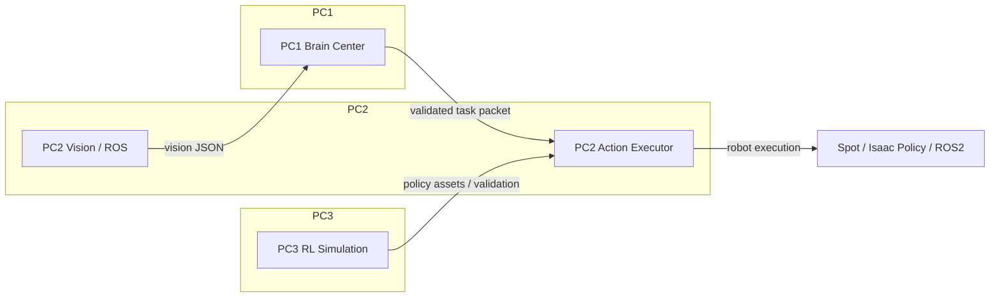

# 춘식이 화성가즈아
### (협동-3) 디지털 트윈 기반 로봇 자동화 시뮬레이션 시스템 구현
### 분산형 VLA 기반 로봇 에이전트 시스템

# 

로컬 3-PC 분산 로봇 제어 시스템으로, PC1 브레인 중심, PC2 비전/ROS/LLM 제어, PC3 Isaac Lab 기반 Spot 강화학습 시뮬레이션을 통합합니다.

## Overview

`Chunsik VLA Brain Agent`는 다중 컴퓨터 환경에서 로봇 인지, 계획, 실행을 분리한 구조로 설계되었습니다. 주요 기능은 실시간 시각 데이터 수신, LLM 기반 작업 계획, ROS2 기반 로봇 액션 실행, Isaac Lab 정책 기반 강화학습 검증입니다.

## Key Features

- **PC1 Brain Center**: Streamlit UI와 Hermes 에이전트를 활용한 작업 패킷 생성, 검증, 전송
- **PC2 Vision + Action**: Florence-2와 OpenCV 기반 이미지 분석, WebSocket 통신, ROS2 네비게이션 및 정책 제어
- **PC3 RL Simulation**: Isaac Lab / Isaac Sim 환경에서 Spot 로봇 강화학습 및 원격 검증
- **WebSocket 기반 분산 통신**: PC1↔PC2 WebSocket으로 시각 데이터 및 작업 명령 정상화
- **정규화된 작업 패킷**: `environment`, `task`, `target`, `sequence`, `amr_pickup_pos`, `amr_drop_pos` 구조로 안전하게 전달

## System Architecture

### Component Summary

| 컴포넌트 | 역할 | 주요 기술 |
|---|---|---|
| PC1 | Brain Center / Task Planner / UI | Streamlit, websocket-client, Hermes Agent, AGENTS.md |
| PC2 | Vision, LLM, Robot Action Executor | Florence-2, Ollama, rclpy, ROS2, OpenCV, PyTorch |
| PC3 | Spot 강화학습 및 시뮬레이션 | Isaac Lab, Isaac Sim, PyTorch, RL 환경 구성 |

### Flow



### Execution Sequence

1. PC2에서 카메라 캡처 및 Florence-2 이미지 분석 수행
2. 분석 결과(객체 목록, 캡션)를 PC1으로 전송
3. PC1에서 Hermes Agent와 AGENTS.md 기반으로 작업 패킷 생성/정규화
4. PC1이 PC2로 작업 패킷 전송
5. PC2가 ROS2/Isaac 정책을 통해 `move`, `pick`, `put` 기반 로봇 동작 수행
6. PC3에서 Spot 강화학습 정책을 학습 및 검증

## Environment

- OS: Linux 기반 Isaac Lab 환경
- Middleware / Framework: ROS2 Humble, Isaac Lab / Isaac Sim
- Python: Python 3.x, Isaac Lab 전용 venv

## Hardware Specifications

- 분산 시스템: 3대 PC 구성
  - PC1: Brain / UI / WebSocket 서버
  - PC2: Vision 분석 및 로봇 액션 실행
  - PC3: Spot 강화학습 및 시뮬레이션
- 로봇 에셋
  - Spot 4족 로봇 시뮬레이션
  - Doosan Arm 매니퓰레이터 USD 에셋
  - XT-32 LiDAR 및 통합 시뮬레이션 에셋
- 네트워크
  - PC1 WebSocket 서버: `192.168.10.23:8889`
  - PC2 명령 서버: `192.168.10.36:9999`

## Dependencies

현재 소스에서 사용되는 주요 Python 패키지는 다음과 같습니다.

```text
rclpy
opencv-python
torch
transformers
Pillow
numpy
websocket-client
websockets
streamlit
streamlit-autorefresh
ollama
isaaclab
isaaclab_rl
isaaclab_tasks
isaaclab_assets
```

> 참고: ROS2 메시지 패키지(`nav2_msgs`, `geometry_msgs`, `sensor_msgs`, `std_srvs`)도 시스템에 설치되어 있어야 합니다.

## Installation & Launch Guide

1. 환경 활성화

```bash
source ~/dev_ws/venv/isaaclab/bin/activate
cd ~/dev_ws/isaac_sim/IsaacLab
```

2. Python 패키지 설치

```bash
pip install -r requirements.txt
```

3. PC1 Brain Center 실행

```bash
python src/pc1/vla_brain_center.py
```

4. PC2 Vision / Action Executor 실행

```bash
python src/pc2/final_code_2/code_llm_module8.py
```

5. PC3 Spot 강화학습 검증 실행

```bash
python src/pc3/Spot reinforcement learning/train/play.py --task Isaac-Velocity-Flat-Spot-v0 --num_envs=1 --checkpoint /path/to/model_39998.pt --teleop
```

6. Spot 강화학습 학습 실행

```bash
python src/pc3/Spot reinforcement learning/train/train.py --task Isaac-Velocity-Flat-Spot-v0
```

## Project Structure

- `src/pc1/vla_brain_center.py` - PC1 브레인 UI 및 WebSocket 서버
- `src/pc1/AGENTS.md` - Hermes Agent 작업 설명 및 정책 템플릿
- `src/pc2/final_code_2/code_llm_module8.py` - PC2 LLM/로봇 액션 메인
- `src/pc2/final_code_2/capture_module.py` - 카메라 이미지 캡처 및 OpenCV 처리
- `src/pc2/final_code_2/move_controller_1.py` - ROS2 네비게이션/위치 복구 및 RL 이동 제어
- `src/pc2/final_code_2/extension.py` - Isaac Sim 정책 로딩 및 모듈 확장
- `src/pc3/Spot reinforcement learning/train/` - Spot RL 학습 및 실행 스크립트
- `src/pc3/Spot reinforcement learning/train/flat_env_cfg.py` - Spot RL 환경 구성
- `src/pc3/Spot reinforcement learning/train/play.py` - Isaac Sim 기반 검증/원격 조작 실행

## Notes

- 실제 실행 환경은 Isaac Lab 전용 가상환경과 ROS2 Humble을 기준으로 합니다.
- WebSocket 주소는 소스 코드에 하드코딩되어 있으며, 네트워크 구성에 맞게 수정해야 합니다.
- `pick.pt`, `place.pt`, `move.pt` 정책 파일이 `src/pc2/final_code_2/`에 있어야 합니다.

# Side Project
================================================================================
🐾 Spot-Doosan Arm Locomotion & Manipulation Execution Guide (README)
================================================================================

1. 개발 및 가상환경 활성화 (Environment Setup)
--------------------------------------------------------------------------------
본 프로젝트는 Isaac Lab 전용 가상환경(venv) 및 ROS2 Humble 아키텍처 상에서 구동됩니다.
시뮬레이션 및 학습 스크립트를 실행하기 전, 새 터미널을 열고 아래 명령어를 순서대로 
입력하여 가상환경 활성화 및 작업 디렉토리 진입을 수행하십시오.

$source ~/dev_ws/venv/isaaclab/bin/activate$ cd ~/dev_ws/isaac_sim/IsaacLab

💡 [TIP] 매번 입력하기 번거롭다면 '~/.bashrc' 맨 아래에 단축어(alias)를 등록하세요:
$ gedit ~/.bashrc
(맨 아랫줄에 다음 추가 후 저장)
alias goisaac="source ~/dev_ws/venv/isaaclab/bin/activate && cd ~/dev_ws/isaac_sim/IsaacLab"

등록 후 터미널에 'goisaac'만 입력하면 환경 활성화와 디렉토리 이동이 동시에 수행됩니다.


2. 프로젝트 주요 파일 및 에셋 위치 (Project Structure)
--------------------------------------------------------------------------------
순정 Isaac Lab 패키지 상태에서는 Doosan Arm 무게중심 튜닝 모델 및 커스텀 에셋이 누락되어
있습니다. 프로젝트 클론 후 반드시 아래 커스텀 파일들을 지정된 경로에 배치하십시오.

1) 로봇 및 시뮬레이션 환경 설정 (Python Config & Scripts)
   * 4족 로봇 상벌점 및 환경 가중치 설정 파일 세트:
     ├── isaaclab_tasks/manager_based/locomotion/velocity/config/spot/flat_env_cfg.py
     └── isaaclab_tasks/manager_based/locomotion/velocity/config/spot/__init__.py
     ※ Doosan Arm 하중(stand_still_scale=25.0) 최적화 및 태스크 등록 정보가 반영된 핵심 파일입니다.

   * 터미널 명령어 인자(Arguments) 파싱 및 학습 제어 유틸리티:
     └── scripts/reinforcement_learning/rsl_rl/cli_args.py
     ※ 이어학습(--resume), 가중치 로드(--checkpoint) 등 터미널 명령어를 제어하는 매개체입니다.

   * 학습 메인 실행 스크립트:
     ├── scripts/reinforcement_learning/rsl_rl/train.py
     └── scripts/reinforcement_learning/rsl_rl/play.py

2) 3D 로봇 및 센서 에셋 (USD Files)
   * Spot 로봇 원본 및 Doosan Arm, XT-32 라이다 결합용 3D 에셋 위치:
     └── ~/dev_ws/isaac_sim/src/
         ├── my_spot.usd              (순정형 Spot 4족 로봇 원본 에셋)
         ├── robot_arm.usd            (Doosan Arm 매니퓰레이터 단독 에셋)
         ├── XT-32.usd                (상단 장착형 3D 라이다 센서 에셋)
         └── my_spot_arm_visual.usd   (Spot + 라이다 + 로봇팔이 최종 결합된 시뮬레이션 메인 에셋)
   ※ 주의: 시뮬레이션 구동 시 위 4개 USD 파일이 반드시 'src' 폴더 내에 함께 존재해야 
     조인트 및 비주얼 링크 붕괴 현상이 발생하지 않습니다.

3) 최종 학습 완료 가중치 파일 (PyTorch Model)
   * 복사할 목적지 경로:
     └── ~/dev_ws/isaac_sim/IsaacLab/logs/rsl_rl/spot_flat/2026-06-11_09-53-39/model_39998.pt
   ※ Mean Reward 397.51을 달성하여 보행 및 제자리 정지 밸런스가 완비된 최적의 소뇌(Policy) 모델 가중치입니다.


3. 강화학습 실행 가이드 (Reinforcement Learning)
--------------------------------------------------------------------------------
※ 대규모 병렬 환경 구동 시 메모리 부족(Killed) 에러가 발생할 수 있습니다.
   이를 방지하기 위해 'flat_env_cfg.py' 내에서 병렬 환경 수를 최적화(num_envs = 64)하고,
   Linux Swap 가상 메모리(32GB)를 확보한 후 학습을 진행하는 것을 권장합니다.

A. 처음부터 새롭게 학습을 시작할 때 (Scratch Training)
   $ python scripts/reinforcement_learning/rsl_rl/train.py --task Isaac-Velocity-Flat-Spot-v0

B. 기존에 중단된 체크포인트부터 이어서 파인튜닝할 때 (Resume Training)
   $ python scripts/reinforcement_learning/rsl_rl/train.py --task Isaac-Velocity-Flat-Spot-v0 --resume --load_run 2026-06-11_09-53-39 --checkpoint "model_.*"


4. 모델 검증 및 원격 제어 (Play & Teleoperation)
--------------------------------------------------------------------------------
학습이 완료된 인공신경망 정책(Policy) 파일(*.pt)의 물리 거동을 시뮬레이터에서 검증하고,
키보드 또는 조이스틱 인터페이스를 활용해 Spot 로봇을 원격으로 수동 조종하는 명령어입니다.

$ python scripts/reinforcement_learning/rsl_rl/play.py --task Isaac-Velocity-Flat-Spot-v0 --num_envs=1 --checkpoint /home/rokey/dev_ws/isaac_sim/IsaacLab/logs/rsl_rl/spot_flat/2026-06-11_09-53-39/model_39998.pt --teleop


5. 제어 공학적 팁: 영점 흐름 방지 (Deadzone Filter)
--------------------------------------------------------------------------------
강화학습 모델 수렴 이후, 영점 지령(정지 상태) 시 로봇이 미세 노이즈나 과보정 여파로 
인해 '좌측 전방'으로 조금씩 밀려 나가는 미세 흐름 현상이 관찰될 수 있습니다.

이를 해결하기 위해 모델을 처음부터 다시 재학습하지 말고, 로봇을 구동하는 최상위 파이썬 
제어 스크립트(Hermes 상위 에이전트 혹은 Task 시퀀서단) 내 환경 step 함수 호출 직전에 
아래와 같이 데드존(Deadzone) 필터 코드를 주입하여 완전 고정 메커니즘을 완성하십시오.

[적용 코드 스니펫 예시]
--------------------------------------------------------------------------------
raw_cmd_x = commands[0]  # 전진 지령 속도
raw_cmd_y = commands[1]  # 좌우 지령 속도

# 0.05 m/s 이하의 미세한 흐름 노이즈 속도는 강제로 완전 정지(0) 처리
filtered_cmd_x = 0.0 if abs(raw_cmd_x) < 0.05 else raw_cmd_x
filtered_cmd_y = 0.0 if abs(raw_cmd_y) < 0.05 else raw_cmd_y

# 최종 필터링된 지령을 소뇌 정책 신경망(Policy) 입력값으로 주입
env.step(action_or_commands=[filtered_cmd_x, filtered_cmd_y, cmd_yaw])
--------------------------------------------------------------------------------

이 보정 필터는 'suction_grasp'(흡착 잡기) 및 'search_qr'(QR 스캔) 태스크 진입 시 
로봇 바디를 강력하게 홀딩시켜 전체 하이브리드 자율 주행 시퀀스의 성공률을 극대화합니다.
================================================================================

